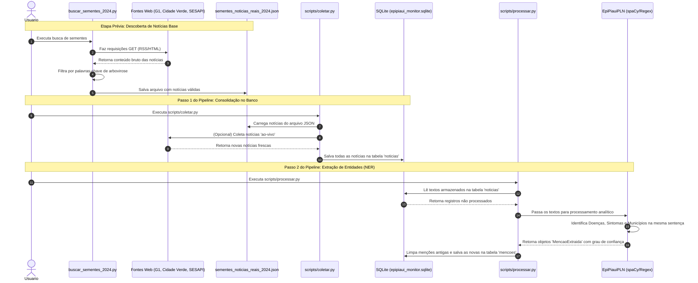

# Manual Resumido: Busca e Processamento de Notícias

O sistema **EpiPiauí Monitor** realiza a busca, coleta e processamento de notícias relacionadas a arboviroses no estado do Piauí. O fluxo é dividido em duas etapas principais: Coleta e Processamento (PLN).

## 1. Coleta de Notícias

A coleta é responsável por buscar notícias em fontes específicas e filtrá-las.

- **Busca de Sementes (`buscar_sementes_2024.py`)**: Este script varre feeds RSS (G1 Piauí) e páginas de listagem de portais de notícias (Cidade Verde, SESAPI). Ele extrai os links, baixa o conteúdo HTML, encontra a data de publicação e o texto.
- **Filtragem Estrita**: Durante a coleta, o sistema verifica se o título ou a URL da notícia contém alguma palavra-chave relacionada a arboviroses. Apenas notícias que dão "match" com esses termos são enriquecidas e armazenadas.
- **Efetivação da Coleta (`scripts/coletar.py`)**: Insere os dados encontrados, amostras ou requisições ao vivo dentro de um banco SQLite para serem consumidas no pipeline.

> **Observação de Refatoração (Valores Hardcoded na Coleta):**
> - **Doenças (Palavras-chave):** No arquivo `buscar_sementes_2024.py`, as palavras de filtro estão fixas na constante `PALAVRAS_CHAVE = {"dengue", "zika", "chikungunya", "arbovirose", "aedes"}`.
> - **Cidades/Regiões (Fontes):** No mesmo arquivo, os alvos de coleta (portais do Piauí) estão estritamente definidos na constante `FONTES` (G1 Piaui, Cidade Verde, SESAPI).
> Para expandir o sistema para outras doenças ou localidades, esses parâmetros precisam ser injetados de forma dinâmica ou via arquivo de configuração.

## 2. Processamento de Notícias (PLN)

Após as notícias serem coletadas, a etapa de Processamento Analítico (`scripts/processar.py` interligado com `src/epipiaui_monitor/pln/processador.py`) analisa os textos extraindo menções com relevância epidemiológica.

- **Reconhecimento de Entidades (NER):** Utilizando o `spaCy` (com fallback de regex simples), o pipeline divide o texto das notícias em sentenças e extrai entidades. Ele mapeia entidades do tipo `DOENCA`, `MUNICIPIO` e `SINTOMA`.
- **Relacionamento e Cálculo de Confiança:** Quando o sistema encontra uma doença e um município referenciados dentro da mesma frase (sentença), ele gera um registro de "Menção Extraída". Ele então calcula uma nota de confiança (base, incrementada se o título da notícia tiver termos chave ou se múltiplos sintomas forem descritos na frase).

> **Configuração do tema (atualizado):**
> - **Doenças, variações e sintomas:** não estão mais fixos no código. O `src/epipiaui_monitor/pln/processador.py` carrega um **domínio de investigação** (`src/epipiaui_monitor/dominio.py`) a partir de um arquivo JSON em `config/dominios/`. O domínio padrão é `arboviroses.json` (Dengue, Zika, Chikungunya e sintomas), com o mesmo conteúdo de antes; para investigar outro tema, basta trocar o arquivo (ex.: `criminalidade.json`) via `--dominio` ou pela variável `EPIPIAUI_DOMINIO` no painel. Detalhes em `docs/dominios.md`.
> - **Cidades (Municípios):** continuam sendo o **eixo fixo**, carregadas pelo módulo `src/epipiaui_monitor/piaui.py` (lista oficial de 224 municípios do Piauí via IBGE, com `MUNICIPIOS_RESERVA` como fallback offline). Por opção de projeto, o município permanece a âncora geográfica.
> - **Coleta de sementes:** o script `buscar_sementes_2024.py` (construtor do corpus fechado) ainda mantém suas próprias constantes `PALAVRAS_CHAVE` e `FONTES`; generalizar essa etapa fica como trabalho futuro.

## 3. Fluxo Completo da Aplicação

O diagrama abaixo ilustra todo o pipeline de execução do projeto, desde a busca da notícia até o processamento das menções, baseado na ordem de chamada pelo orquestrador `scripts/executar_pipeline.py`.

