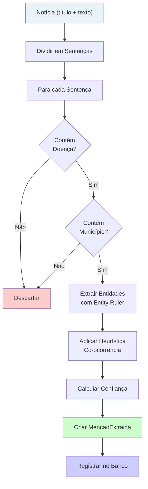
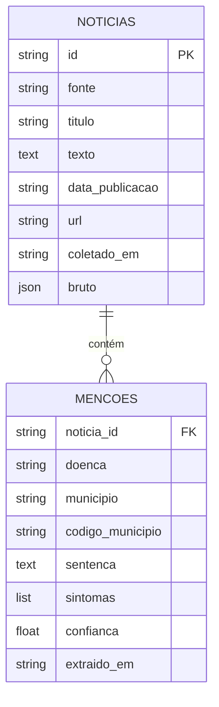
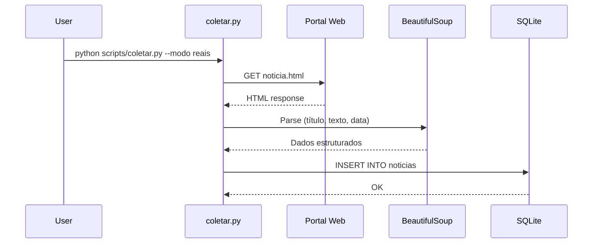
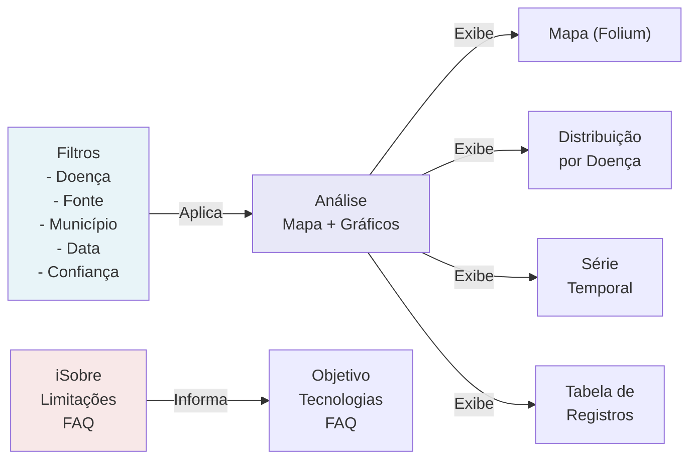
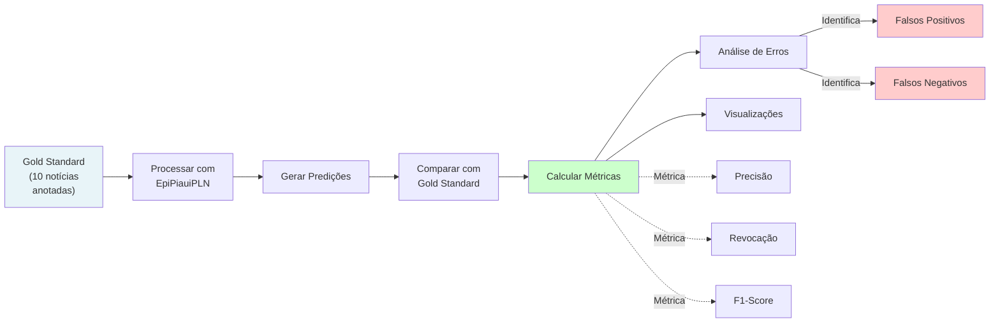

# Relatório Técnico do Protótipo

## 1. Arquitetura Geral

```mermaid
graph LR
    A["Fontes Públicas<br/>(G1, Cidade Verde, SESAPI)"] -->|Web Scraping| B["Coleta<br/>coletar.py"]
    B --> C["Armazenamento Bruto<br/>(JSON + SQLite)"]
    C --> D["PLN com spaCy<br/>processador.py"]
    D --> E["Extração de Entidades<br/>(Doenças, Municípios, Sintomas)"]
    E --> F["Banco de Dados<br/>(Tabela mencoes)"]
    F --> G["Dashboard Streamlit<br/>painel.py"]
    G --> H["Visualizações<br/>(Mapa + Gráficos)"]
    
    style A fill:#e8f4f8
    style B fill:#ffe8e8
    style C fill:#fff4e8
    style D fill:#e8f8e8
    style E fill:#e8e8f8
    style F fill:#f4e8f8
    style G fill:#f8e8e8
```



## 2. Fluxo de Processamento PLN



## 3. Modelo de Dados



## 4. Componentes Principais

### 4.1 Módulo de Coleta (`coletores/`)

```
coletores/
├── html.py        → Scraping genérico com BeautifulSoup
├── noticias.py    → Coleta de G1 e Cidade Verde
└── sementes.py    → Carregamento de URLs verificadas
```

**Fluxo de coleta:**



### 4.2 Pipeline PLN (`pln/processador.py`)

O `EpiPiauiPLN` encadeia:

1. **Carregamento do modelo spaCy**
   - Tenta: `pt_core_news_lg` → `pt_core_news_md` → `pt_core_news_sm` → básico

2. **Instalação de Regras Customizadas**
   - Entity Ruler com padrões de:
     - Doenças (dengue, zika, chikungunya)
     - Municípios (224 cidades do Piauí)
     - Sintomas (febre, dor de cabeça, etc.)

3. **Processamento por Sentença**
   - Coocorrência: doença + município na mesma sentença
   - Extração de sintomas (elevam confiança)

4. **Cálculo de Confiança**
   - Base: 0.6 (doença + município)
   - +0.1 (sintoma presente)
   - +0.1 (termo epidemiológico no título)
   - Máximo: 0.8

### 4.3 Interface Web (`interface/painel.py`)

**Componentes do Dashboard:**



## 5. Decisões de Implementação

O EpiPiaui Monitor foi estruturado como um MVP reprodutível. A coleta, o processamento e a visualização são etapas separadas para facilitar auditoria e repetição dos experimentos.

Na versão atual, o modo principal (`reais`) usa um conjunto de URLs reais localizadas em fontes piauienses entre janeiro e julho de 2024. As sementes ficam em `dados/brutos/sementes_noticias_reais_2024.json`.

O banco SQLite foi escolhido por ser leve, portátil e suficiente para a prova de conceito. O material bruto fica na tabela `noticias`, enquanto as inferências ficam na tabela `mencoes`.

Para PLN, o pipeline usa spaCy com `EntityRuler`. O modelo recomendado é `pt_core_news_lg`, mas há reserva para modelos menores ou para um pipeline básico em português. Essa decisão permite que a demonstração funcione mesmo em ambientes sem o modelo grande instalado.

## 6. Heurística de Extração

O protótipo considera uma menção válida quando uma doença e um município aparecem na mesma sentença. Sintomas na mesma sentença elevam a confiança. A presença de termo epidemiológico no título também aumenta levemente a pontuação.

Essa escolha privilegia explicabilidade: cada registro extraído preserva a sentença original, permitindo revisão manual.

## 7. Processo de Avaliação (Notebook 02)



### Métricas por Tipo de Entidade

```
DOENCA:
  - TP: Verdadeiros positivos (dengue corretamente detectada)
  - FP: Falsos positivos (entidade detectada mas não estava)
  - FN: Falsos negativos (entidade não detectada)
  - Precisão = TP / (TP + FP)
  - Revocação = TP / (TP + FN)
  - F1 = 2 * (Precisão * Revocação) / (Precisão + Revocação)
```

## 8. Dificuldades Encontradas

- Portais de notícia podem mudar HTML, URLs, paginação e metadados sem aviso.
- O Cidade Verde retornou bloqueio Cloudflare 403 em parte das tentativas de coleta automatizada; nesses casos, o protótipo preserva a URL e usa texto curto de apoio marcado como reserva.
- Nem toda página pública expõe data de publicação em formato padronizado.
- Nomes de municípios podem aparecer com ou sem acento, exigindo normalização.
- Ambiguidade textual: uma notícia pode citar vários municípios e várias doenças sem afirmar relação epidemiológica direta.
- Dados de notícias não equivalem a notificações oficiais de saúde.

## 9. Limites Deliberados

- O MVP não realiza coleta contínua.
- O período-alvo documentado é janeiro a julho de 2024.
- O painel é exploratório e não deve ser usado como sistema oficial.
- A amostra sintética permanece apenas como reserva didática; o fluxo padrão usa notícias e informes reais de 2024.

## 10. Possíveis Melhorias

- Adicionar validação manual de menções no painel.
- Persistir HTML bruto além do texto extraído.
- Incorporar classificação supervisionada para reduzir falso positivo.
- Criar testes automatizados com páginas HTML congeladas.
- Publicar um relatório de avaliação com precisão, revocação e exemplos anotados.
